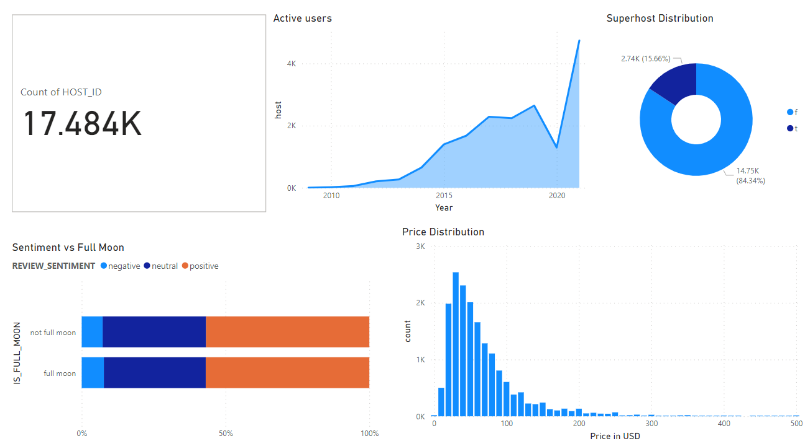

# Analytics Engineering with Airbnb Data

Welcome to the Airbnb Analytics Engineering project, where we'll delve into the world of data loading, cleansing, and exposure using dbt (Data Build Tool) with Snowflake as the Data Warehouse. This project aims to showcase various dbt functionalities and provide a comprehensive analytics solution for Airbnb data.

## Tech Stack

<p align="left">
  
  
  
</p>

## Project Setup

To get started, make sure you have the following tools installed:

- Python 3.10
- Create a virtual environment:

```bash
virtualenv venv
```

- Activate the virtual environment:

```bash
venv\Scripts\activate
```

- Install dbt and the Snowflake adapter:

```bash
pip install dbt-snowflake==1.5.9
```

- Initialize your dbt project:

```bash
mkdir %userprofile%\.dbt
dbt init project_name
```

## Project Goals

1. **Easy-to-follow Modeling Changes:** Ensure that all modeling changes are easy to follow and revert when necessary.
2. **Explicit Dependencies:** Define explicit dependencies between models for a clear understanding of data flow.
3. **Exploration of Dependencies:** Explore dependencies between models to enhance the understanding of data relationships.
4. **Data Quality Tests:** Implement data quality tests to ensure the accuracy and reliability of the analytics solution.
5. **Error Reporting Mechanisms:** Develop error reporting mechanisms to promptly identify and address issues in the data pipeline.
6. **Incremental Load of Fact Tables:** Optimize performance by implementing incremental loading for fact tables.
7. **Tracking History of Dimension Tables:** Track the history of dimension tables to analyze changes over time.
8. **Easily Accessible Documentation:** Create easily accessible documentation to enhance collaboration and understanding of the data model.

## Data Model


## Data Flow Staging Layers


## Directed Acyclic Graph (DAG)


## BI Dashboard


